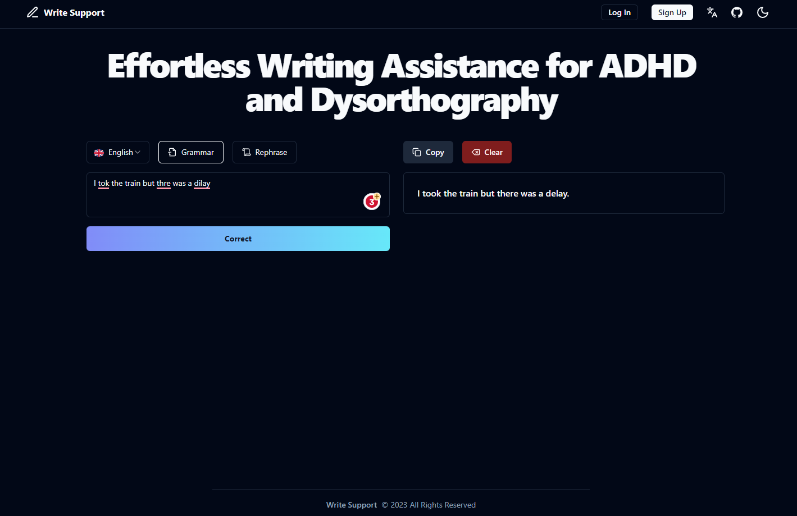

# Write Support

Effortless Writing Assistance for ADHD and Dysorthography powered by OpenAI and ChatGPT.



> **Note**
This project is still in development and is not ready for production use.

## Features

- **Framework**: [Next.js](https://nextjs.org/)
- **Database**: [Supabase](https://supabase.com/)
- **Authentication**: [Clerk](https://clerk.com/)
- **Internationalization (i18n)**: [next-intl](https://next-intl-docs.vercel.app/)
- **Styling**: [Tailwind CSS](https://tailwindcss.com/)
  - **Primitives**: [Radix UI](https://radix-ui.com/)
  - **Components**: [shadcn/ui](https://ui.shadcn.com/)
  - **Icons**: [Lucide](https://lucide.dev/)
- **Deployment**: [Vercel](https://vercel.com/)
- **Analytics**: [Vercel Analytics](https://vercel.com/analytics/)
- [Zod](https://zod.dev/) for TypeScript-first schema declaration and validation  
- Automatic import sorting with `@ianvs/prettier-plugin-sort-imports`

## Running Locally

1. Clone the repository and install the dependencies

```bash
git clone https://github.com/giacomogaglione/write-support.git
cd write-support
pnpm install
pnpm dev
```

2. Copy the `.env.example` to `.env` and update the variables.

```bash
cp .env.example .env
```

3. Start the development server

```bash
pnpm run dev
```

## License

Licensed under the [MIT license](https://github.com/giacomogaglione/write-support/blob/main/LICENSE.md).
